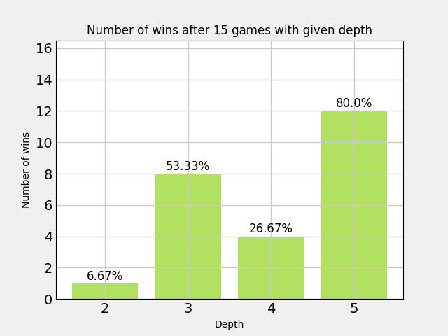

# 2048

The clone of the game called 2048 using pygame, python with a bot that uses Expectimax (variation of Minimax) algorithm to make moves.

---

# Features

- playing by pressing W,A,S,D or arrows
- chance to undo the last move
- restarting game
- showing the current score and saving the best ones in a file
- letting the bot play

---

# Measurments - 15 games




# Following measurments

Measurments of depth 3 and 4 after more games - 30, since they were quite confusing after 15 games (it could be due to randomness of the game).

...

---

### Starting the game

```bash
pip install pygame
python main.py
```
