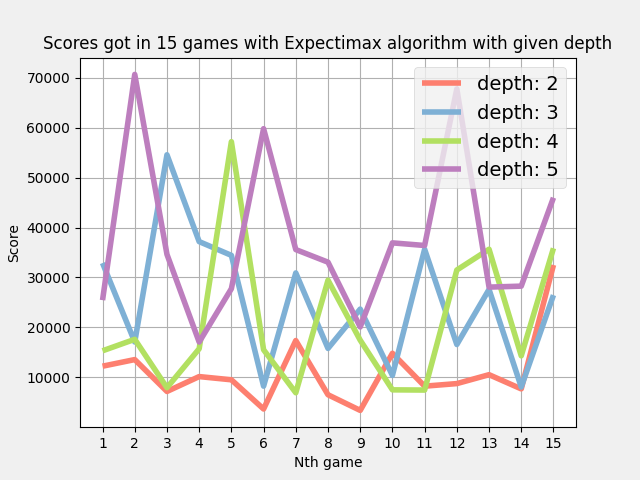

# 2048

The clone of the game called 2048 using pygame, python with a bot that uses Expectimax (variation of Minimax) algorithm to make moves.

---

# Expectimax algorithm

Expectimax algorithm simulates all different moves in a game up to a given depth. After that, it calculates scores for each possible move (starting from the last depth of the search tree) and picks move that seem most likely to lead to the best outcome at a given time (maximizing player case) or picks the average value of the moves (minimzing player case) recursively. At the end, we get the move that is the most promising one.

The main difference between Minimax and Expectimax is that in Expectimax, in minimizing player case, we don't assume that the minimazing player will make its best possible move in order to minimize the board evaluation. In Expectimax, we assume, that a minimizing player will make a move with evaluation equal to the average evaluation of all possible moves for minimizing player (based on probabilities of the moves), since we can't assume it otherwise due to randomness of the game.

---

# Evaluation of the board

## It takes into account:

- Number of empty fields
- Spreading (how many rows, columns and diagonal are in decreasing order)
- Smoothness (diffences of values between neighbouring fields)
- Blocked fields
- Position of the best and the second best value

---

# Features

- playing by pressing W,A,S,D or arrows
- chance to undo the last move
- restarting game
- showing the current score and saving the best ones in a file
- letting the bot play

---

# Measurments - 15 games




# Following measurments

Following measurments of depth 3 and 4 after 10 games, since they were quite confusing in plots above (it could be due to randomness of the game).


...

# How it looks


### Starting the game

```bash
pip install pygame
python main.py
```
